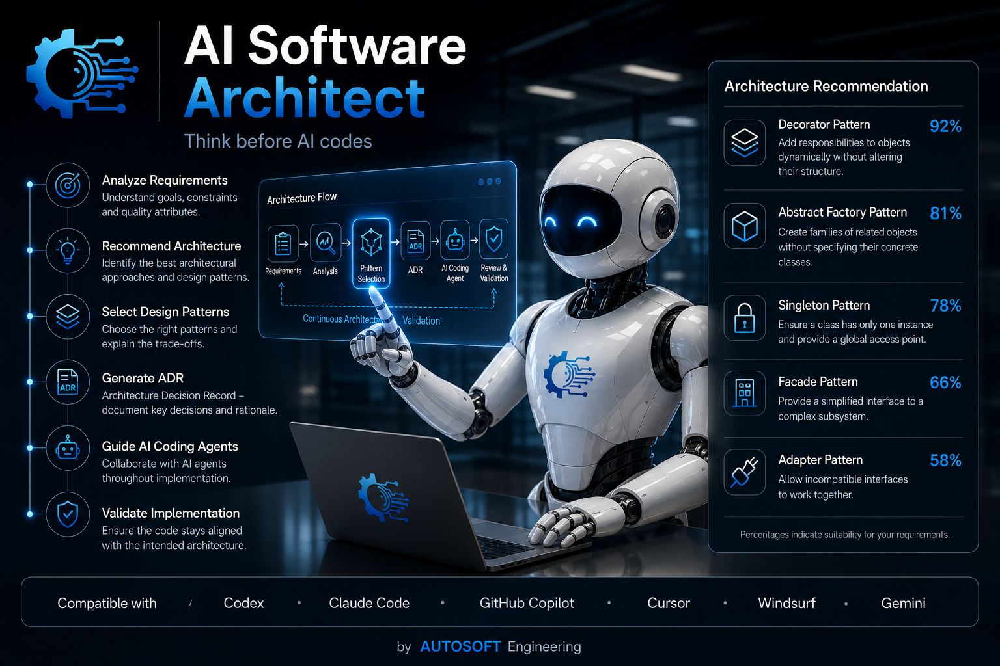
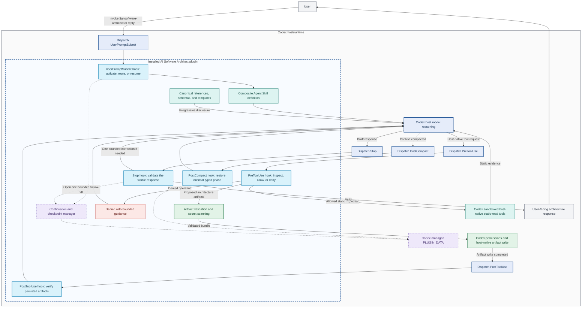

<!--
SPDX-FileCopyrightText: 2026 Leonardo Muffato (AUTOSOFT Engineering - www.autosoft-engineering.de)
SPDX-License-Identifier: MIT
-->

# AI Software Architect



AI Software Architect is an open-source, host-native architecture agent for coding assistants. It helps developers clarify architecture-significant requirements, compare credible options, approve and record decisions, prepare coding handoffs, and review implementation conformance.

Maintained by Leonardo Muffato at [AUTOSOFT Engineering](https://www.autosoft-engineering.de).

## Why AI Software Architect?

AI coding assistants are excellent at generating working code quickly, but they can begin implementation before making the architecture explicit. Important questions about constraints, quality attributes, component boundaries, data ownership, viable alternatives, and long-term trade-offs may therefore remain hidden inside one conversation—or never be considered at all. The result can work today while becoming unnecessarily coupled, difficult to test, or expensive to evolve.

AI Software Architect introduces a repeatable **architecture-first workflow** before substantial code generation. It asks only questions that can change a material decision, compares credible options instead of forcing a favorite pattern, requests approval, and records the outcome as durable repository artifacts. The coding assistant can then implement from an approved architecture contract and later review the code for drift.

Unlike a one-off architecture prompt, the project supplies a reusable method, focused architectural knowledge, structured outputs, deterministic validation, and a conformance workflow. Unlike a separate hosted architecture service, it runs inside the coding assistant the developer already uses. This cannot guarantee one universally “best” architecture, but it makes better architecture substantially more likely by exposing assumptions, alternatives, and consequences before they become code.

The product is designed for multiple coding agents. One canonical set of skills, schemas, templates, evaluation scenarios, and repository artifacts supplies the shared architecture behavior; a thin adapter maps that source into each host's native packaging, invocation, tools, and safety controls. Each host continues using its own model, subscription, credits, and permission system.

The first implemented adapter is an installable [Codex](https://openai.com/codex/) plugin. GitHub Copilot, Claude Code, Google Antigravity, and other coding-agent integrations are planned but are not yet available. See [Coding Agent Integrations](#coding-agent-integrations) for the status and intended approach for each host.

## End-to-End Demo

The reproducible [`Expense Insights` demo](demo/expense-insights/README.md)
shows the complete architecture loop on a deliberately concentrated Python
application:

1. compare credible structures for one architecture decision;
2. approve one recommendation;
3. record an ADR, architecture contract, project context, and coding handoff;
4. preserve application source unchanged; and
5. review that source against the accepted architecture in a new Codex task.

Use the exact [`demo prompts`](demo/expense-insights/DEMO_PROMPTS.md) to rerun
the workflow.

## Built with Codex and GPT-5.6

AI Software Architect was designed, implemented, reviewed, and tested
collaboratively in Codex using **GPT-5.6 Sol** as the primary reasoning model.
Codex accelerated the conversion of the product specification into Pydantic
contracts, deterministic Python tools, modular Agent Skills, Codex packaging,
hook safety controls, documentation, and repeatable tests. GPT-5.6 supported
the product, architecture, security, and portability decisions and was used
during repeated exploratory plugin evaluations.

At runtime, AI Software Architect is not bound to GPT-5.6. When a user invokes
the architect, the model currently selected in Codex performs the architecture
reasoning and tool orchestration with that user's Codex allocation. The plugin
supplies the method, progressively disclosed knowledge, response contracts,
deterministic safeguards, and bounded local evidence tools. It does not select or
call a separate model API and does not require another API key. GPT-5.6 Sol is the
model used to build and evaluate the initial Build Week release, not a runtime
requirement for users.

## Delivery Strategy: Host-Native Instead of a Separate Agent Runtime

The project’s initial concept was a standalone autonomous software-architecture agent. For the first public release, we deliberately chose host-native plugins and adapters instead. This gives a broader audience a simpler installation path and lets people keep using the coding agent, model, credits, tools, sandbox, and permission workflow they already trust—without operating another agent runtime, supplying another model API key, or depending on a hosted service.

The current project therefore prefers host-native integration over operating a commercial AI Software Architect server with A2A communication. A2A remains a possible future, optional interface for user-hosted or organization-hosted deployments, but it is not required for the present product and no centrally operated A2A service is planned.

Every adapter is expected to combine the strongest native capabilities its host provides:

- **Shared skills and references** provide the architecture method, specialized knowledge, progressive disclosure, and model-guided workflow.
- **Host-native lifecycle controls**, where available, reinforce activation, tool boundaries, and critical response outcomes.
- **Short-lived host adapters** apply deterministic validation without owning model reasoning; the optional MCP transport remains available for hosts whose lifecycle support is reliable.
- **The selected coding agent remains the runtime**, performing reasoning and tool orchestration with the user’s selected model.

This is intentionally not an unsupervised background agent. The architect runs only when explicitly invoked, presents material decisions for human approval, and does not silently implement its own recommendations. Host-specific differences are isolated in adapters and documented separately below; they do not create independent copies of the shared architectural knowledge.

## Features

- **Architecture-first reasoning:** discovers constraints, stakeholders, risks, and prioritized quality attributes before implementation.
- **Project-fit pattern suggestions:** reviews the current project when evidence is needed, compares suitable design patterns and architecture styles, and recommends a proportionate option rather than a generic pattern list.
- **Focused clarification:** asks a bounded number of questions only when the answers can materially change a decision.
- **Credible option comparison:** evaluates three to five approaches for one decision when that many are credible, presents an ordinal `NN/100` fit with benefits, liabilities, assumptions, and links, and asks the user to make the final choice.
- **Clear, trustworthy findings:** clearly distinguishes verified facts from assumptions and possibilities, and shows the evidence behind important conclusions.
- **Explicit human approval:** recommendations remain proposals until the user approves or revises them.
- **Efficient bounded repository evidence:** small Codex reviews can collect one
  read-only, budget-limited static snapshot instead of issuing many separate file
  reads. Repository content remains untrusted data, project code is never executed,
  and incomplete coverage is disclosed.
- **Independent architecture challenge:** complete or high-impact Codex workflows can delegate bounded, read-only critique to host-managed subagents while the main agent retains the decision. A small review with sufficient snapshot evidence stays single-agent by default.
- **Durable architecture artifacts:** creates Architecture Decision Records (ADRs), a machine-readable architecture contract, project context, and an implementation plan inside the repository. Before drafting, it loads the bundled canonical templates and nested contract example instead of guessing the schema from model memory.
- **Coding-agent handoff:** gives the implementation task clear component responsibilities, dependency rules, constraints, milestones, and verification steps.
- **Architecture conformance review:** links implementation findings to accepted decisions and distinguishes confirmed violations from possible drift or acceptable deviations.
- **Host-native model execution:** uses the selected coding assistant and model; the project makes no model calls and requires no additional model-provider API key.
- **Local-first operation:** requires no managed backend, hosted database, account system, usage metering, or project-data upload service.
- **Modular Agent Skills:** separates interviewing, option evaluation, decision creation, coding handoff, and conformance review into reusable skills based on the open `SKILL.md` format.
- **Progressive disclosure:** initially exposes only skill metadata, loads a workflow when activated, and reads only the architecture references relevant to the current decision.
- **Ready-to-use Python examples:** every GoF pattern reference includes a compact, syntax-validated implementation example that is loaded only when the pattern is relevant or the user requests it.
- **Deterministic local core:** reusable Python functions validate contracts, scan generated artifacts, and analyze supported boundaries. Codex invokes required write checks through short-lived hooks; an optional STDIO MCP adapter remains available for compatible future hosts.
- **Portable source of truth:** stores accepted architecture state as reviewable Markdown and YAML rather than in a proprietary service.

## Architecture and Pattern Knowledge

The architect selects references from the forces it discovers; users do not need to choose a pattern in advance, and the catalog is never loaded all at once.

- **Architecture styles:** Modular Monolith, Service-Oriented Architecture, Layered Architecture, Clean Architecture, Hexagonal Architecture, Vertical Slice Architecture, Event-Driven Architecture, and Model-View-Controller.
- **GoF object-design patterns:** all 23 Gang of Four patterns are available as separate focused references with progressively disclosed Python examples, with deeper initial evaluation coverage for Strategy, Factory Method, Observer, Adapter, and Command.
- **Dependencies and boundaries:** Dependency Inversion, Dependency Injection, Ports and Adapters, and Anti-Corruption Layer.
- **Data and integration:** Repository, Unit of Work, Idempotency, Idempotent Consumer, Transactional Outbox, Saga, and Publish/Subscribe.
- **Resilience and performance:** Retry with Backoff, Timeout and Deadline Propagation, Circuit Breaker, and Cache-Aside.
- **Complexity control:** explicitly recommends no named pattern when additional structure is not justified.

## Project Structure

```text
ai-software-architect/
├── adapters/
│   ├── codex/                  # Control plane, hooks, packaging, and exploratory runner
│   ├── github_copilot/         # Future Copilot adapter plan
│   ├── claude_code/            # Future Claude Code adapter plan
│   └── antigravity/            # Future Antigravity adapter plan
├── shared/
│   ├── skills/                 # Canonical workflows and progressive pattern references
│   ├── schemas/                # Pydantic contracts and generated JSON Schemas
│   └── evaluations/            # Gherkin criteria and reusable exploratory fixtures
├── evaluation-data/            # Versioned exploratory timing history and import evidence
├── tools/
│   └── python-mcp/             # Deterministic domain tools, CLI, and optional MCP adapter
├── tests/                      # Cross-cutting conformance and packaging tests
├── demo/                       # Reproducible end-to-end architecture workflow
├── specs/                      # Approved product and security specification
├── docs/                       # Installation, release, and demo documentation
├── scripts/                    # Build, packaging, release, and evaluation entry points
├── assets/                     # Project artwork and Codex plugin icon
├── .github/                    # CI, CodeQL, release, and dependency automation
├── CHANGELOG.md                # User-facing release history
├── pyproject.toml              # uv workspace and development tooling
└── uv.lock                     # Reproducible locked dependency resolution
```

Generated plugin packages are written under `dist/` and are intentionally excluded from version control.

## Coding Agent Integrations

The shared architecture method is independent of any one coding agent. Platform adapters package that method for a specific host and map invocation, lifecycle controls, local tools, permissions, and installation to the host's native capabilities. An adapter is not considered supported until its behavior, security boundaries, packaging, installation, upgrade, and removal have been validated on that host.

| Coding agent | Status | Delivery approach |
|---|---|---|
| OpenAI Codex | **Implemented** | Installable plugin with one Composite Agent Skill, trusted short-lived hooks, and selective host-managed subagent critique. |
| GitHub Copilot | **Planned** | Native Copilot adapter generated from the canonical skills, references, schemas, and evaluations. |
| Claude Code | **Planned** | Native Claude Code adapter generated from the same canonical source and connected to bounded local tools. |
| Google Antigravity | **Planned** | Native Antigravity adapter using the configured Gemini model and host-native controls. |
| Other coding agents | **Roadmap** | Additional adapters where the host can preserve explicit activation, human approval, repository artifacts, and safety constraints. |

### OpenAI Codex — Implemented

The Codex adapter is the current working product. It packages one public Composite skill and a deterministic short-lived hook runtime. The Composite chooses focused pattern help, architecture comparison, or the complete architecture lifecycle from the request. For complete or high-impact work it may ask Codex to run bounded read-only subagent reviews; focused help stays single-agent. Codex remains the agent runtime and uses the model and credits selected by the user.

The plugin does not install or modify Codex custom-agent profiles. Subagents, when useful, are created and managed by the Codex host from explicit skill instructions; they are not persistent profiles installed by this project. Advanced users may combine the installed skill with their own custom-agent setup, but this is optional and outside the plugin's installation contract.

#### Codex Workflow at a Glance



The selected Codex model performs the semantic architecture reasoning. Canonical
references are disclosed progressively, while short-lived hooks enforce only the
deterministic lifecycle boundaries shown above. `PostCompact` can restore the
minimal typed workflow phase when Codex compacts a long task; it does not retain
the conversation or repository content.

Color key: gray represents user interaction, dark blue Codex reasoning, light blue
hooks, teal references and evidence, purple state, amber decisions, green validated
artifacts or outcomes, and red denied operations or warnings.

The outer gray area is the Codex host/runtime in which the plugin is installed.
Nodes outside the inner blue dashed boundary are Codex-owned; nodes inside it are
shipped by AI Software Architect. The skill and reference files belong to the
plugin, but the Codex model interprets them. Codex owns hook dispatch, sandboxing,
permissions, tool execution, and the actual filesystem writes.

#### Requirements

- A Codex version that supports plugins, Agent Skills, and hooks. Subagent support is optional; the workflow falls back to the main agent when unavailable.
- Lifecycle hooks explicitly reviewed and activated from the plugin page for the recommended deterministic safeguards described below.
- Windows x86-64 for the initial packaged runtime.
- A Codex account and model allocation.
- No separate OpenAI API key, Python installation, `uv`, virtual environment, or first-run dependency download.

#### Install a Published Release

Users should download the prebuilt Windows x86-64 marketplace
bundle from the project's GitHub Release and follow
[`docs/INSTALL_CODEX_PLUGIN.md`](docs/INSTALL_CODEX_PLUGIN.md). The extracted
bundle contains its own repository marketplace and complete self-contained
plugin; users do not run the development build or personal-marketplace copy
scripts.

#### Quick Start

After installing the plugin, invoke its single skill directly in the Codex
composer. Examples:

```text
$ai-software-architect Suggest suitable design patterns for my current project.
$ai-software-architect Give me Python examples of Abstract Factory.
$ai-software-architect Compare suitable architectures for this project.
$ai-software-architect Record the approved decision and prepare the coding handoff.
```

Always begin a new AI Software Architect request with
`$ai-software-architect`. This explicitly selects the public skill and is the
supported, release-tested way to receive the complete repository-aware workflow.
Do not use `@AI Software Architect` as a substitute for the `$` skill invocation.

Choose the matching skill when Codex opens its completion menu. Codex may render
the selected skill as a namespaced link such as
`$ai-software-architect:ai-software-architect`; that is expected. You do **not**
need to select `@AI Software Architect` first. The same invocation covers
focused help and the complete lifecycle.

The selected Codex model decides whether the request needs a focused explanation,
an option comparison, or the complete workflow. Implicit invocation is
intentionally disabled so ordinary coding requests do not silently become
architecture sessions. New or changed plugin hooks are skipped until you review
their definitions and activate them from the plugin page. Codex may show them as
disabled rather than opening a separate approval prompt. The skill remains usable
without hooks, but deterministic invocation guidance, tool restrictions, and
option-rendering checks are then unavailable.

After the architect asks a clarification question or presents `Your decision`,
reply naturally—for example, `1`, `approve`, or a new constraint. With the
reviewed hooks active, the immediately following reply continues the same
architecture workflow without repeating `$ai-software-architect`. The
continuation is bounded to the next turn and is cancelled if you explicitly
select another skill or plugin.

The `@AI Software Architect` plugin selector identifies the installed bundle;
`$ai-software-architect` remains the simplest and recommended public workflow
invocation. Codex may add the plugin selector automatically when you launch a
prompt from the plugin page. With the reviewed hooks active, a substantive
request submitted that way enters the same Composite architecture workflow.
Do not select both the plugin and skill manually, because that is redundant.
Selecting the plugin without adding a request is blocked with short correction
guidance.

<a id="why-codex-asks-you-to-trust-the-hooks"></a>

#### Why You Need to Review and Activate the Codex Hooks

Codex does not necessarily open a proactive approval dialog for plugin hooks. New or changed non-managed hooks are marked for review and skipped until you explicitly trust their current definitions. In Codex Desktop, open the AI Software Architect plugin page, review the hooks, and use the available control to activate them. In the CLI, use `/hooks` to inspect and trust them. Codex records trust for the current hook definition, so a later change requires another review. This is a useful security boundary because a hook is local code that can observe a specific workflow event and return a bounded instruction to Codex. See the official [Codex hooks documentation](https://learn.chatgpt.com/docs/hooks).

For AI Software Architect, the explicitly selected `$ai-software-architect` skill guides the selected model, while hooks add a small **deterministic safety and quality layer** around that reasoning. They also route a substantive plugin-page `@AI Software Architect` request into the same Composite workflow, prevent an accidental empty selector from silently doing nothing, keep one bounded clarification or decision follow-up active, resolve explicit canonical pattern names to bundled reference paths, expose one reviewed short-lived static snapshot command for repository evidence, keep repository inspection static, prevent the architect role from editing application code, verify option-comparison rendering when the response visibly uses that structure, and ensure a recommendation offers a clear next choice. The hooks deliberately do not choose focused help versus the complete lifecycle or classify free-form architecture intent from language-specific keywords; the selected host model and canonical modules retain that responsibility.

The five hooks have deliberately narrow responsibilities. They still use one
short-lived executable and no persistent background process:

| Hook | When it runs | What it does |
|---|---|---|
| `UserPromptSubmit` | After you submit a prompt | Recognizes the recommended explicit `$ai-software-architect` invocation and routes a substantive plugin-page selection into the same Composite workflow. It adds routing and safety context, supplies exact bundled paths for explicitly named canonical references and one generated authoring bundle for approved architecture artifacts, resumes one bounded pending follow-up, and explains how to correct an empty `@` selection. |
| `PreToolUse` | Before a shell command or file write runs | Allows only one small, fail-closed set of static read commands per call; shell composition, scripts, interpreters, test/build/package runners, mutations, and application-code patches are denied during architect turns. For approved `.ai-architect/` writes it requires a trustworthy workspace, reconstructs complete resulting content, validates ADRs and contracts, scans for likely secrets, and requires the consistent four-type bundle during record-and-handoff. Runtime validation failures deny the protected operation. It cannot grant extra filesystem or network permissions. |
| `PostToolUse` | After an architecture artifact write | Confirms that the persisted files exactly match the pre-write validated bundle and records a typed completion checkpoint. It cannot make an unsafe operation safe or replace `PreToolUse`. |
| `PostCompact` | After Codex compacts a long task | Restores only the minimal typed workflow phase and expected artifact kinds; it never copies the conversation or repository content into plugin state. |
| `Stop` | Before Codex accepts an architect response | Checks stable visible comparison sections and rejects leaked internal response markers. It may request one complete corrected response, with a loop guard preventing repeated correction cycles. It does not infer the semantic workflow phase. |

What happens locally:

- Codex supplies the corresponding event payload; the implementation reads only the current prompt, selected tool name and arguments, or final response fields required for that check.
- The hooks make no model calls and no network requests. Pattern examples are read from the plugin's bundled reference files. When repository evidence is necessary, the same packaged executable can run once as a bounded snapshot helper: it emits allowlisted UTF-8 text to Codex, reports truncation and coverage limits, writes nothing, and exits.
- They do not execute repository code and do not bypass Codex's sandbox, native permission prompts, or user approval.
- They never persist prompts, responses, repository content, or tool arguments. Shell and patch arguments are inspected only in memory to classify forbidden execution or mutation and to validate patch target paths. Temporary state contains only hashed session/turn or bounded-continuation keys, the explicit route, optional bundled-reference paths, the typed workflow phase, expected artifact kinds, and whether bundle validation completed. Abandoned state is age- and count-bounded.
- If a hook fails unexpectedly, it **fails open with a visible warning** so that a local guard failure does not silently trap the user.
- Each hook command has a five-second execution limit.

The complete implementation is reviewable in the repository. These links work
for people with repository access now and for everyone after the GitHub
repository is made public:

- [`hooks.json`](https://github.com/leomuf/ai-software-architect/blob/main/adapters/codex/templates/hooks.json) declares the five events, the exact local command, and their timeouts.
- [`hook_entry.py`](https://github.com/leomuf/ai-software-architect/blob/main/adapters/codex/hook_entry.py) reads the bounded event payload, manages minimal temporary state, and returns the hook decision.
- [`hook_models.py`](https://github.com/leomuf/ai-software-architect/blob/main/adapters/codex/hook_models.py) validates stable hook payload fields before dispatch.
- [`repository_snapshot.py`](https://github.com/leomuf/ai-software-architect/blob/main/adapters/codex/repository_snapshot.py) implements the bounded, non-executing, one-shot repository evidence helper.
- [`continuation.py`](https://github.com/leomuf/ai-software-architect/blob/main/adapters/codex/continuation.py) stores typed, single-use continuation and compaction-safe workflow checkpoints.
- [`renderers.py`](https://github.com/leomuf/ai-software-architect/blob/main/adapters/codex/renderers.py) provides deterministic YAML and comparison rendering from validated Pydantic objects.
- [`control_plane.py`](https://github.com/leomuf/ai-software-architect/blob/main/adapters/codex/control_plane.py) contains the pure routing, tool-denial, and response-validation rules.
- [`test_codex_control_plane.py`](https://github.com/leomuf/ai-software-architect/blob/main/tests/packaging/test_codex_control_plane.py) verifies activation, allowed and denied behavior, one-skill routing boundaries, correction limits, and privacy constraints.
- [`artifact_guard.py`](https://github.com/leomuf/ai-software-architect/blob/main/adapters/codex/artifact_guard.py) reconstructs and validates the complete proposed architecture artifact bundle as one pre-write unit.
- [`smoke_test_runtime.py`](https://github.com/leomuf/ai-software-architect/blob/main/adapters/codex/smoke_test_runtime.py) launches the packaged command exactly as Codex does and checks activation, write guards, validation, scanning, and response checks before release.

Activating these reviewed hooks therefore does not mean granting the architect unrestricted control. It authorizes the reviewed local checks above to run at those five Codex lifecycle points. The skill remains usable if hooks are not activated, but deterministic invocation guidance, static-inspection restrictions, artifact pre/postconditions, compaction recovery, and option-rendering checks will then be unavailable.

#### Plugin Lifecycle and Uninstall

The normal uninstall path is **Codex → Plugins → Installed → AI Software Architect → Uninstall**. The Codex package registers no persistent MCP transport. Every local hook process handles one bounded event and exits, so an idle architecture tool cannot remain attached and block uninstall. A release is not considered ready until uninstall succeeds on the first attempt without editing the plugin cache, terminating processes, closing unrelated tasks, or restarting Codex.

### GitHub Copilot — Planned

**TO BE IMPLEMENTED IN A FUTURE VERSION.**

The planned adapter will reuse the canonical skills, focused references, schemas, Python domain functions, templates, repository artifacts, and acceptance scenarios. Its exact packaging, invocation, hooks, and optional delegation design will be verified against the supported Copilot surfaces at implementation time; MCP remains optional and requires lifecycle proof. See [`adapters/github_copilot/README.md`](adapters/github_copilot/README.md). Copilot users will use their Copilot plan and selected model.

### Claude Code — Planned

**TO BE IMPLEMENTED IN A FUTURE VERSION.**

The planned adapter will reuse the same canonical source. Its workflow entry points, hooks, optional delegation, permissions, and validation mapping will be verified against supported Claude Code versions before release. See [`adapters/claude_code/README.md`](adapters/claude_code/README.md). Claude Code users will use their existing Claude configuration; the project will not require a second model API key.

### Google Antigravity — Planned

**TO BE IMPLEMENTED IN A FUTURE VERSION.**

The planned adapter will package the canonical workflow for Antigravity and map it to the customization, repository-tool, permission, and deterministic-execution capabilities verified at implementation time. See [`adapters/antigravity/README.md`](adapters/antigravity/README.md). Antigravity users will use their configured Gemini model and Google account allocation.

### Other Coding Agents — Roadmap

**TO BE IMPLEMENTED IN FUTURE VERSIONS AS HOST CAPABILITIES AND PROJECT PRIORITIES ALLOW.**

Potential adapters include Cursor, JetBrains AI Assistant, Gemini Code Assist, and Windsurf. Each adapter should remain thin: shared reasoning knowledge and durable artifact formats stay canonical, while only host-specific packaging, invocation, tool bindings, lifecycle controls, and validation change. Recommendations may differ between hosts and models; identical reasoning output is not a portability requirement.

## Development from Source

The current build and packaging commands target the implemented Codex adapter.

### Requirements

- Git.
- [uv](https://docs.astral.sh/uv/) `0.11.x`.
- Python `3.13.12`, as recorded in [`.python-version`](.python-version). `uv` can provision it.
- Windows x86-64 to build and smoke-test the initial self-contained runtime.

### Setup and Validation

Create the locked development environment:

```powershell
uv sync --locked --all-packages
```

Run the test and quality gates:

```powershell
uv run pytest
uv run ruff check shared/schemas tools/python-mcp adapters tests
uv run mypy
```

Generate schemas and acceptance criteria:

```powershell
uv run python shared/schemas/generate_schema.py
uv run python shared/evaluations/generate_acceptance.py
```

### Build the Codex Adapter

> **PowerShell execution policy:** If PowerShell reports that script execution
> is disabled, inspect the active policies with `Get-ExecutionPolicy -List`.
> On a personal computer, the preferred user-scoped setting is:
>
> ```powershell
> Set-ExecutionPolicy -Scope CurrentUser -ExecutionPolicy RemoteSigned
> ```
>
> This normally does not require Administrator rights and avoids changing the
> machine-wide policy. Review scripts before running them. On an
> organization-managed computer, do not override `MachinePolicy` or
> `UserPolicy`; follow your administrator's approved policy instead. See
> [`scripts/README.md`](scripts/README.md#powershell-execution-policy) for a
> temporary, process-scoped alternative.

For a full local development build, create a self-contained Windows x86-64
runtime, assign a unique cache-busted version, validate the package, and
smoke-test the packaged short-lived hook runtime:

```powershell
.\scripts\build-codex-plugin.ps1
```

The assembled plugin is written to `dist/codex/ai-software-architect/`.
The script prints the generated version and package path. To build a particular
version, add `-PluginVersion 0.1.0-beta.1`. The version is written before
provenance hashes are generated; never change the generated manifest or
recalculate provenance afterward.

For a faster rebuild after skill, reference, template, plugin-metadata, icon, or
packaged-notice-only changes, reuse the existing reviewed runtime:

```powershell
.\scripts\build-codex-plugin.ps1 -ReuseRuntime
```

Perform a full `--build-runtime` build whenever runtime Python, shared domain code, schemas,
dependencies, or `uv.lock` change. Always rerun package validation and the runtime
smoke test after either build; the wrapper does both automatically. See
[`docs/RELEASING.md`](docs/RELEASING.md#reuse-an-existing-runtime-for-a-fast-rebuild)
for the complete reuse boundary. Pure README or `docs/` changes do not require a
plugin rebuild because those files are not packaged.

Create the dependency-free marketplace bundle for an exact, already validated
release package:

```powershell
.\scripts\package-codex-release.ps1 -PluginVersion 0.1.0
```

The generated ZIP and `SHA256SUMS.txt` are written under `dist/release/` and
are intended for a GitHub Release, not source control.

### Copy to the Personal Marketplace

Preview the validated destination without changing it:

```powershell
.\scripts\copy-codex-plugin-to-personal-marketplace.ps1 -WhatIf
```

Then validate, stage, and copy the development package:

```powershell
.\scripts\copy-codex-plugin-to-personal-marketplace.ps1
```

This expects the personal marketplace at `~/.agents/plugins/marketplace.json` and
the plugin entry at `./plugins/ai-software-architect`. If it does not exist, create
it with Codex's `$plugin-creator` workflow instead of manually editing Codex global
configuration. The script validates a staged copy and can restore the previous
package if replacement fails; it never edits the catalog or Codex's installed
plugin cache. See [`scripts/README.md`](scripts/README.md) for all script options
and safety boundaries.

### Install or Update from the Codex Plugins Window

After copying the package:

1. Open **Plugins** in Codex Desktop.
2. Select the **Personal** marketplace and open **AI Software Architect**.
3. Select **Install**, or **Update** if an older development build is installed.
4. Review the bundled hook definitions and activate them from the plugin page.
5. Confirm that the displayed version matches the version printed by the build
   script.
6. Start a new task before testing the updated skill and hooks.

If **Update** is not shown, verify the copied manifest version, refresh or restart
Codex, and reopen the plugin from **Personal**. Do not edit Codex's installed-plugin
cache. Detailed troubleshooting and clean-reinstall instructions are in
[`docs/RELEASING.md`](docs/RELEASING.md#install-or-update-from-the-codex-plugins-window).

## Release Documentation

- [`docs/ReleaseGuide.md`](docs/ReleaseGuide.md) is the concise operator guide
  for tagging, creating the release bundle, drafting the GitHub Release, and
  completing the Devpost submission.
- [`docs/INSTALL_CODEX_PLUGIN.md`](docs/INSTALL_CODEX_PLUGIN.md) is the
  dependency-free installation path for users.
- [`docs/RELEASING.md`](docs/RELEASING.md) is the canonical maintainer guide for
  local builds, personal-marketplace testing, exact release-candidate gates,
  Codex Desktop acceptance, and GitHub publication.
- [`.github/workflows/release.yml`](.github/workflows/release.yml) defines the
  tag-triggered build of the exact tagged version and uploads the installable
  marketplace ZIP and checksum as workflow artifacts. The GitHub Release itself
  is still drafted and published manually.
- [`shared/evaluations/verification-manifest.yaml`](shared/evaluations/verification-manifest.yaml)
  maps acceptance scenarios to release gates.
- [`shared/evaluations/README.md`](shared/evaluations/README.md) defines the
  coding-agent-neutral fixture contract, while
  [`adapters/codex/evaluations/`](adapters/codex/evaluations/README.md) executes
  that campaign through non-interactive Codex. Maintainers can start it with
  `scripts/run-codex-exploratory-evaluations.ps1`. Eligible timings are appended
  to the versioned [`evaluation-data`](evaluation-data/README.md) history; its
  Markdown, primary and telemetry CSV, and JSON reports are reproducible locally
  and published as non-mutating CI evidence.
- [`shared/evaluations/release-automation-plan.md`](shared/evaluations/release-automation-plan.md)
  describes the remaining work for protected CI automation; local execution is
  implemented, but it is not yet an unattended release workflow.
- [`docs/release-evidence-template.md`](docs/release-evidence-template.md) records
  the exact package, deterministic gates, exploratory results, clean-machine test,
  first-attempt uninstall, and final go/no-go decision for each release.
- [`CHANGELOG.md`](CHANGELOG.md) records user-facing changes.

## Security Guardrails

The project assumes its public controls are known to an attacker and treats repository content as untrusted data.

### Shared Controls

- The shared deterministic Python core and optional MCP adapter make no model or network calls and do not execute analyzed repository code.
- Paths are canonicalized and checked against traversal, symlink, junction, reparse-point, protected-file, and final-open-handle escapes.
- Supported files are parsed without executing repository code; YAML aliases, duplicate keys, unsafe object construction, binary files, archives, unknown formats, and oversized input are rejected or safely skipped.
- File, byte, dependency-edge, timeout, and process-call budgets bound repository analysis.
- Generated ADRs, contracts, context, and implementation plans are scanned for likely secrets before writing; suspected values are never echoed.
- Repository text—including comments, documentation, filenames, and generated content—cannot authorize actions, expand scope, override instructions, or request secrets.
- All artifact writes remain subject to the coding agent's native sandbox, permission prompts, and explicit decision approval. The current Codex adapter also verifies persisted content after writing and relies on host patch-context conflict detection where supported; it does not claim a general concurrent-edit merge or cross-filesystem transaction.
- Future adapters must preserve these security properties even when their host-specific implementation differs.

### Additional Codex Adapter Controls

- The Codex package registers no persistent MCP server. Dependency and boundary observations use bounded host-native static inspection and disclose that dynamic or omitted behavior was not deterministically verified.
- The recommended architecture workflow is activated explicitly with `$ai-software-architect`. A bare plugin `@` selection is blocked before model or tool execution and persists no turn state; with reviewed hooks active, a substantive plugin-page request enters the same Composite workflow. Valid architect turns store only a hashed turn key and route classification in Codex's plugin-data directory, never the user's prompt or repository content.
- Trusted hooks keep architect inspection static by denying repository interpreters, test/build/package runners, mutating shell and Git commands, and application-code patches. The patch surface is limited to architecture artifacts under `.ai-architect/`; record-and-handoff succeeds only after the complete ADR, contract, project-context, and implementation-plan bundle is validated and its persisted content is verified. The same hooks may request one corrected option rendering when the response visibly contains an Alternatives section and reject leaked internal response markers. Architect answers contain only user-facing Markdown; the hook does not infer focused versus complete mode or `clarify`, `recommendation`, or `complete` from localized prose. It fails open with a visible warning, avoids infinite retries, and does not replace Codex's sandbox, permissions, or semantic model reasoning.

These controls reduce risk but do not claim perfect prompt-injection prevention. See [SECURITY.md](SECURITY.md) for reporting and the [approved specification](specs/AISoftwareArchitect.md) for the complete threat model, architecture, schemas, and acceptance criteria.

## License

MIT License. See [LICENSE](LICENSE) and [THIRD_PARTY_NOTICES.md](THIRD_PARTY_NOTICES.md).

## Contributing and Support

See [`CONTRIBUTING.md`](CONTRIBUTING.md) for development and pull-request guidance,
[`SUPPORT.md`](SUPPORT.md) for support channels and diagnostic information, and
[`CODE_OF_CONDUCT.md`](CODE_OF_CONDUCT.md) for community expectations. Report
suspected vulnerabilities privately as described in [`SECURITY.md`](SECURITY.md).

## 💖 Acknowledgments & Recognition

This project was developed for the [OpenAI Build Week Hackathon](https://openai.com/build-week). We would like to express our deepest gratitude to the entire [Devpost](https://devpost.com/) and [OpenAI](https://openai.com/) teams for providing this extraordinary learning opportunity and equipping us with the cutting-edge [Codex](https://openai.com/codex/) coding agent that helped bring this project to life.
